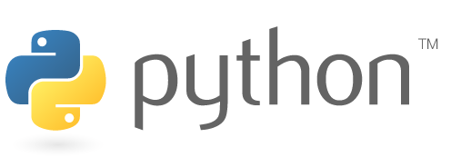
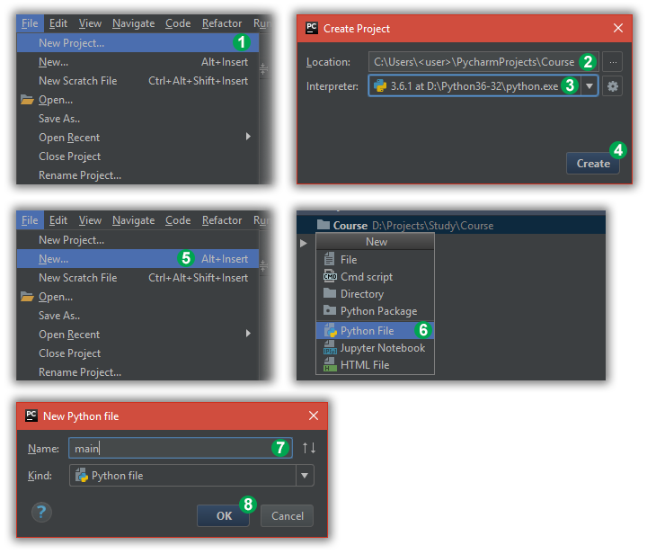

Course setup
============

Required software
-----------------

* Python 3
* PyCharm

.. note:: The code in the course is supposed to be cross-platform, but it is only tested on Windows.

|

Download and install the latest version: https://www.python.org/downloads/

Make sure you select and install version 3, **not version 2**.

|

There is a community edition freely available for personal use: https://www.jetbrains.com/pycharm/download/

Download and install it.

.. _create-project:

Create project
--------------

PyCharm speeds up and simplifies working on python code and is convenient for using in this course. You need to
create a project for using PyCharm. Follow these steps to create a project:

1. Click `File` -> `New Project...`
2. You can change the default "untitled" project name in the `Location` field
3. Make sure version 3 is selected in the `Interpreter` field
4. Press the `Create` button
5. Click `File` -> `New...`
6. Select `Python File`
7. Enter "main" in the `Name` filed
8. Press `OK`

